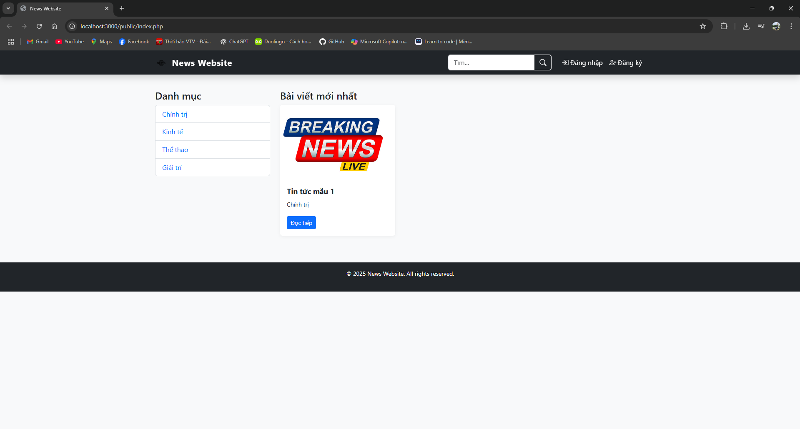
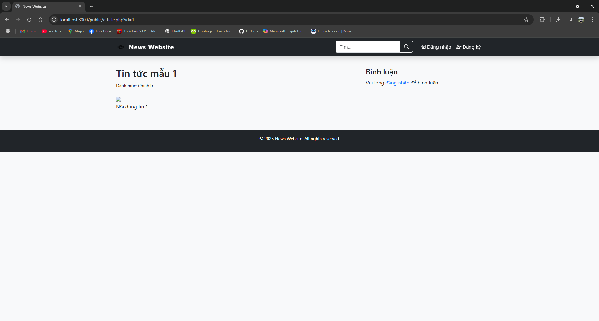
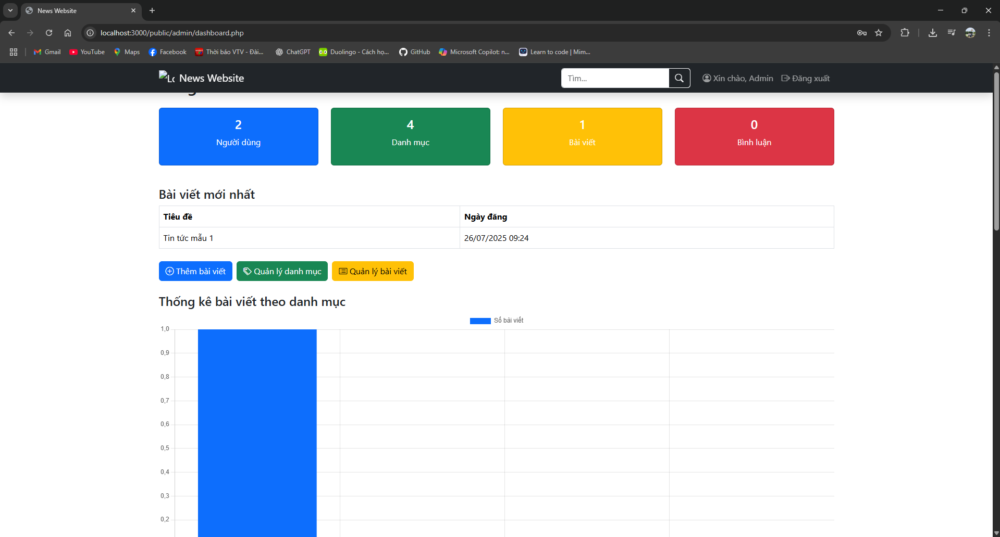

# News-Website 📰

Website tin tức đơn giản sử dụng **PHP + SQL Server**, gồm **frontend cho người dùng** và **backend (Admin)** để quản lý bài viết, danh mục, bình luận.

---

## 📌 Tính năng chính

### Người dùng
- Xem tin tức theo danh mục  
- Tìm kiếm bài viết  
- Đăng ký / Đăng nhập / Đăng xuất  
- Bình luận bài viết  

### Quản trị viên
- Đăng nhập quản trị  
- Quản lý bài viết (CRUD)  
- Quản lý danh mục  
- Quản lý bình luận  
- Dashboard với thống kê + biểu đồ trực quan  

---

## 🛠 Công nghệ sử dụng

- **Backend**: PHP 8.x (Procedural) + SQL Server  
- **Frontend**: HTML5, CSS3, Bootstrap 5, Bootstrap Icons  
- **Biểu đồ**: Chart.js  
- **Web Server**: XAMPP (Apache) + SQLSRV Driver  

---

## 📂 Cấu trúc thư mục

News-Website/<br>
│── config/ # Cấu hình kết nối SQL Server<br>
│── includes/ # Header, Footer, Functions<br>
│── public/ # Giao diện chính + Admin<br>
│ ├── index.php<br>
│ ├── category.php<br>
│ ├── article.php<br>
│ ├── search.php<br>
│ └── admin/<br>
│ ├── dashboard.php<br>
│ ├── articles.php<br>
│ ├── add_article.php<br>
│ └── categories.php<br>
│── assets/ # CSS, JS, Image<br>
│── database.sql # Script tạo database + seed data<br>
│── README.md<br>
│── LICENSE<br>
└── .gitignore<br>

---

## 🚀 Cài đặt và chạy project

### 1. Giải nén project vào XAMPP

C:\xampp\htdocs\News-Website

### 2. Cài đặt SQL Server và Import Database
- Mở `database.sql` → Thực thi trong SSMS để tạo database `News_Website`.

### 3. Cấu hình kết nối
Sửa file `config/db.php`:

```php
$serverName = "localhost";
$connectionOptions = [
    "Database" => "News_Website",
    "Uid" => "sa",
    "PWD" => "123456",
    "CharacterSet" => "UTF-8"
];
```

### 4. Bật driver php_sqlsrv

- Tải từ Microsoft: Download Drivers
- Thêm vào php.ini:
```ini
extension=php_sqlsrv.dll
extension=php_pdo_sqlsrv.dll
```
- Khởi động lại Apache.

### 5. Chạy project
- Truy cập: http://localhost/News-Website/public/index.php
- Admin: http://localhost/News-Website/public/admin/dashboard.php

## 🔑 Tài khoản mẫu
Admin<br>
Username: admin<br>
Password: 123456<br>

## 📊 Giao diện Dashboard

Dashboard hiển thị:

- Thống kê số lượng **Users, Categories, Articles, Comments**
- **Biểu đồ cột**: Số bài viết theo danh mục
- **Biểu đồ tròn**: Tỷ lệ User/Admin
- **Bảng bình luận mới nhất**

## 📸 Demo giao diện

### Trang chủ


### Trang chi tiết bài viết


### Trang quản trị


## 📜 License
Project phát hành theo giấy phép MIT License.

## ⭐ Hỗ trợ & Đóng góp
Mở issue nếu gặp lỗi hoặc cần tính năng mới.

Gửi pull request để đóng góp code.

Hướng dẫn push lên GitHub
```bash
git init
git remote add origin https://github.com/hoangminhbao8102/News-Website.git
git add .
git commit -m "Initial commit - News Website PHP + SQL Server"
git push -u origin main
```

---
